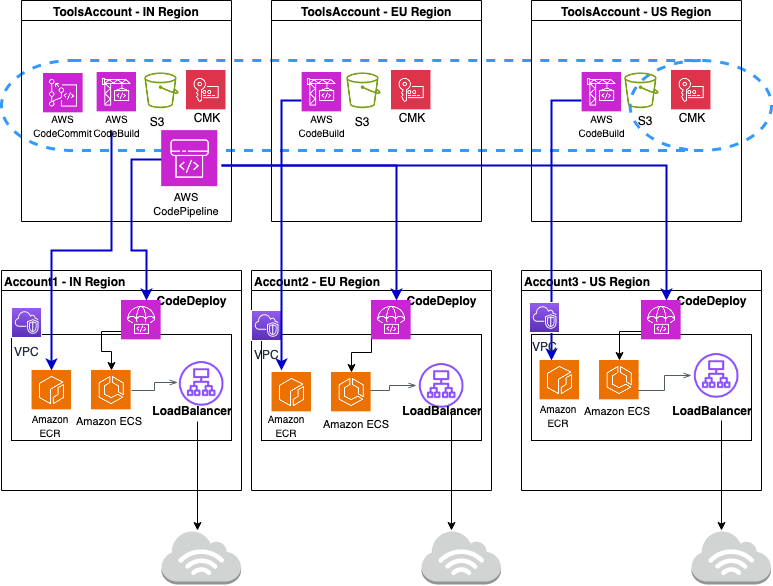
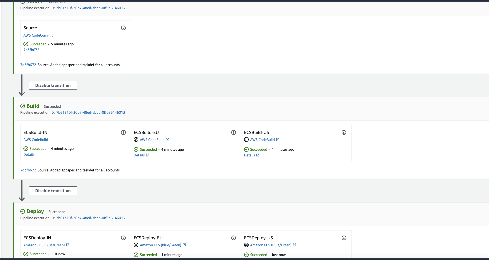

# Global Blue/Green deployments in multiple regions and accounts for ECS Fargate using AWS Codepipeline and Cloudformation

## Overview

- Customer is looking for a deployment from a centralised account to multiple accounts and across regions for a Global application. The software development /code development happens only in the centralised account and workload / applications are spread across multiple accounts and across regions. The encryption and decryption must happen only with a single CMK Multi region key (covering Disaster Recovery scenario). 
- As per security guidelines from customer, same CMK should be used across regions for encryption and decryption. CMK is region specific and it has to be maintained or created in 3 different regions for pipeline artifacts. Multi region CMK helps to retain the same key id across regions. 
- Gitflow workflow branching model should be implemented with two branches (develop and main) for merging the codes from develop to main branch with a PR. 

### What is covered here ?
- This pattern covers all the above requirements and provides a sample IaC setup using AWS cloudformation stacks) to demonstrate this. 
- Blue/Green deployment of microservices is implemented using AWS CodeDeploy in AWS Codepipeline.
- The regions considered here in the steps are as follows:
   - Tools / CodeCommit Account - **ap-south-1**
   - Workload / Test account 1 - **ap-south-1**
   - Workload / Test account 2 - **eu-central-1**
   - Workload / Test account 3 - **us-east-1**
- The lamdba function deployed from this stack will create a PR from develop to main branch. The PR merge to main branch will trigger the Codepipeline to orchestrate the CI/CD flow and deploy the stacks across accounts.

## Pre-Requisites
- Four AWS accounts to implement this pattern.
- Tools Account - Codepipeline is managed and Codecommit repository is maintained here.
- Three workload /test accounts to deploy the microservice workload.
- S3 bucket created specific to respective deployment region in each workload account. (Referred in below as S3BUCKETNAMETESTACCOUNT1, S3BUCKETNAMETESTACCOUNT2 and S3BUCKETNAMETESTACCOUNT3)
  - Example - To create bucket in specific region with unique available bucket name (replace `xxxx` with some random numbers in below command):
    - In Test Account 1
       aws s3 mb s3://ecs-codepipeline-`xxxx`-ap-south-1 --region ap-south-1
    - In Test Account 2
        aws s3 mb s3://ecs-codepipeline-`xxxx`-eu-central-1 --region eu-central-1
    -  In Test Account 3
       aws s3 mb s3://ecs-codepipeline-`xxxx`-us-east-1 --region us-east-1

## Architecture

### Technology stack  

- [AWS CloudFormation](https://aws.amazon.com/cloudformation/)
- [AWS CodeCommit](https://aws.amazon.com/codecommit/)
- [AWS CodeBuild](https://aws.amazon.com/codebuild/)
- [AWS CodeDeploy](https://aws.amazon.com/codedeploy/)
- [AWS CodePipeline](https://aws.amazon.com/codepipeline/)

## Tools Required
- Git - command line utility to work with codecommit repository.
- docker - To build and test docker images locally.
- cfn-lint and cfn-nag - To review the cloudformation stacks for any errors and security check.

## Solution Implementation
The above discussed architecture is implemented in below steps using cloudformation templates.

### Infrastructure Deployment Steps
- Create the infrastructure components in the architecture like VPC, Application Load balancer, ECS, ECR the cloudformation stacks in `Infra` directory.
- Package and deploy the cloudformation stacks in all three work load accounts in the respective region.
- Ensure the values in multiple `exports` from the respective cloudformation stacks are not modified as they are referred in codepipeline, codedeploy stacks.
- Push a sample image to ECR and scale ECS Service.
- Verify if the initial service deployment is accessible using Load balancer.

### CodeCommit, Codebuild, CodeDeploy and CodePipeline Deployment Steps
- Create codecommit repository in ToolsAccount. The templates are in `code` directory.
- Create S3 bucket for managing artifacts generated by codepipeline in all 3 regions.
- Setup Multi region CMK KMS Key as primary key and replica keys which will be used by Codepipeline.
- Setup CodeBuild Project in ToolsAccount to build and push images to ECR in all 3 regions.
- Setup CodeDeploy in Workload accounts in respective regions. Ensure the codedeploy is associated with ALB listener ARN created from Infra setup.
- Create codepipeline in Tools Account. Provide access for codepipeline, codebuild roles in KMS key policy and S3 bucket policy.

### Testing and Verification of Blue/Green CodeDeploy in Codepipeline
- Create a new index.html or modify the contents in index.html. 
- Modify the input artifacts `taskdef.json`, `appspec.yaml` with relevant parameters like **accountid** 
- Push Dockerfile, buildspec.yaml to codecommit repository.
- Invoke pipeline and verify if in respective stages:
 - **Codecommit** - Source code includes the latest commit.
 - **Codebuild** - Builds and pushes image to ECR.
 - **Codedeploy** - Deploys the latest image to ECS using latest taskdef.json and appspec.yaml.
- Access the load balancer using FQDN and verify if the latest changes are visible.

### Status

### Optional
- Create a new feature branch from main branch.
- Push changes to feature branch and create a PR to main branch.
- Verify if lambda function approves the merge and invoke pipeline.

### Summary

- **Development:** The software/code development occurs in a centralized account.

- **Deployment Across Multiple Accounts and Regions:** The deployment involves spreading workload/applications across multiple accounts and regions.

- **Encryption and Decryption:** The use of a single Customer Master Key (CMK) for encryption and decryption across regions, specifically for a Disaster Recovery scenario.

- **CMK Management:** The CMK is region-specific and needs to be maintained or created in three different regions for pipeline artifacts. A multi-region CMK is preferred for consistency in key identification across regions.

- **Gitflow Workflow:** Implementation of a Git workflow branching model with two branches (develop and main) for merging code changes from the develop branch to the main branch using pull requests (PR).

## Cleanup
- Scale down ECS Service to 0. Clean up any images from ECR repository.
- Delete all objects from S3 artifact buckets.
- Delete the cloudformation stacks deployed in Tools account and respective workload accounts.

## Contributing
See [CONTRIBUTING](CONTRIBUTING.md#security-issue-notifications) for more information.

## Security
See [SECURITY](SECURITY.md) for more information.

## License
This library is licensed under the MIT-0 License. See the [LICENSE](LICENSE) file.
